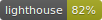

  </img>

<h1 align="center">React Finder - guide to React JavaScript library</h1>

  

This is React Web Application with the integration of tools such as React Context and Hooks, Lottie Animations, Auth0 Authentication with fast Github and Google Login, QraphQl (all data published and managed at Contentful), Bootstrap component library, Responsive Design, Formspree form backend email service.
Application created for community as links to Free Helpful Resources, which cover React, React Native, Redux and GraphQl materials.

<!-- lighthouse-badges --urls https://www.youtube.com/ https://www.youtube.com/feed/trending -o test_results -->

---

<h2 align="center"> Technologies</h2>

Project is created with:

<ul>
  <li>React: 16.13.0</li>
  <li>Bootstrap 4: (4.4.1)</li>
  <li>Auth0 Authentication (auth0-js): 9.13.1</li>
  <li>SASS: 4.13.1</li>
  <li>Contentful: 7.14.3</li>
  <li>React Lottie: 1.2.3</li>
  <li>Formspree (backend email service)</li>
</ul>

---

<h2 align="center"> Launch and Content</h2>

To launch this project, go to https://react-finder.netlify.app/

<h3 align="center"> Navigation</h3>

  

<h3 align="center"> Login</h3>

Auth0 Authentication with easy Github and Google Login.

  

<h3 align="center"> Personal Account</h3>

Search functionality, Adding interesting resources and courses to account, Managing resources, Customize account.

  

<h3 align="center"> Edit more personal helpful links</h3>

(editing, removing, adding) resources and courses.

  

<h3 align="center"> Recommend</h3>

Recommend additional materials for everyone, all your recommendations will be added ASAP.
Formspree form backend email service was used.

  

<h3 align="center">Responsive Design</h3>

  

---

<h2> Support</h2>

Reach out to me at one of the following places!

Website at [React Finder](https://react-finder.netlify.app/)

Twitter at [AndrewZer](https://twitter.com/AndrewZer)

LinkedIn at [Andrew Zernov](https://www.linkedin.com/in/andrei-zernov/)

---

<h2> License</h2>

MIT license 

Copyright 2020 © React Finder

